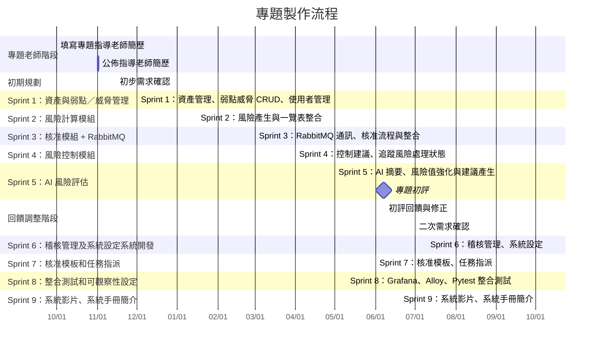

```mermaid
gantt
    title 專題製作流程
    dateFormat  YYYY-MM-**DD**
    axisFormat  %m/%d

    section 專題老師階段
    填寫專題指導老師簡歷        :a1, 2024-10-01, 2024-10-31
    公佈指導老師簡歷            :a2, 2024-11-01, 1d

    section 初期規劃
    初步需求確認                :pre1, 2024-11-15, 2024-11-30

    section Sprint 1：資產與弱點／威脅管理
    Sprint 1：資產管理、弱點威脅 CRUD、使用者管理 :s1, 2024-12-01, 2025-01-15

    section Sprint 2：風險計算模組
    Sprint 2：風險產生與一覽表整合                 :s2, 2025-01-16, 2025-02-28

    section Sprint 3：核准模組 + RabbitMQ
    Sprint 3：RabbitMQ 通訊、核准流程與整合         :s3, 2025-03-01, 2025-03-31

    section Sprint 4：風險控制模組
    Sprint 4：控制建議、追蹤風險處理狀態            :s4, 2025-04-01, 2025-04-30

    section Sprint 5：AI 風險評估
    Sprint 5：AI 摘要、風險值強化與建議產生          :s5, 2025-05-01, 2025-05-31

    專題初評                                         :milestone, e1, 2025-06-06, 2d

    section 回饋調整階段
    初評回饋與修正                                   :adj1, 2025-06-08, 2025-06-20

    二次需求確認                :pre2, 2025-07-01, 2025-07-05

    section Sprint 6：稽核管理及系統設定系統開發
    Sprint 6：稽核管理、系統設定                     :s6, 2025-07-10, 2025-08-31

    section Sprint 7：核准模板和任務指派
    Sprint 7：核准模板、任務指派                     :s7, 2025-09-01, 2025-09-15

    section Sprint 8：整合測試和可觀察性設定
    Sprint 8：Grafana、Alloy、Pytest 整合測試         :s8, 2025-09-15, 2025-10-01

    section Sprint 9：系統影片、系統手冊簡介      
    Sprint 9：系統影片、系統手冊簡介         :s9, 2025-10-2, 2025-10-07
```