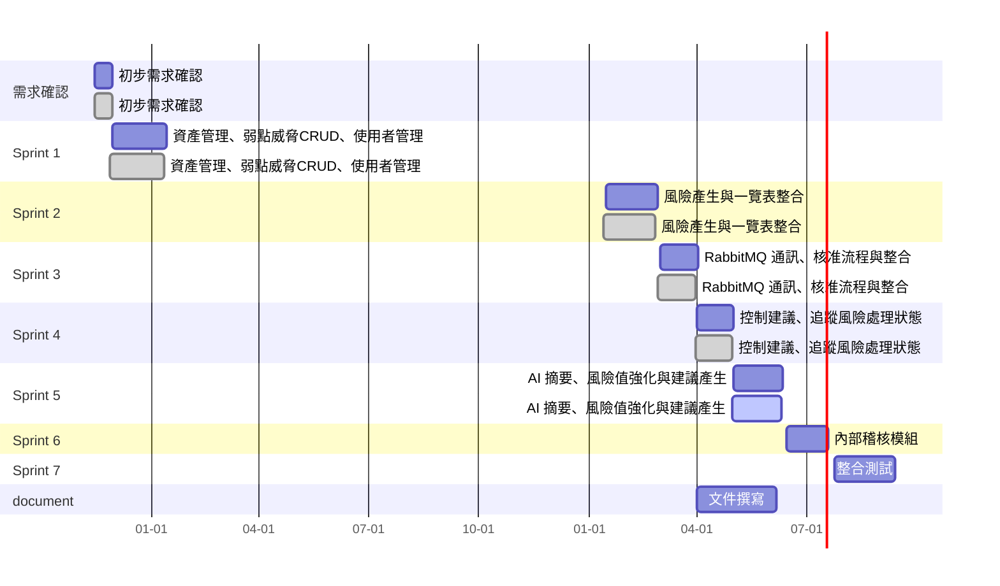

```mermaid
gantt
    dateFormat  MM-DD
    axisFormat  %m-%d
    section 需求確認
        初步需求確認: 2024-11-15, 15d
        初步需求確認: done,2024-11-15, 15d
    section Sprint 1
        資產管理、弱點威脅CRUD、使用者管理: 2024-11-30, 45d
        資產管理、弱點威脅CRUD、使用者管理: done,2024-11-28, 45d
    section Sprint 2
        風險產生與一覽表整合:01-15, 43d
        風險產生與一覽表整合:done,01-13, 43d
    section Sprint 3
        RabbitMQ 通訊、核准流程與整合:03-01, 32d
        RabbitMQ 通訊、核准流程與整合:done,02-27, 32d
    section Sprint 4
        控制建議、追蹤風險處理狀態:04-01, 30d
        控制建議、追蹤風險處理狀態:done,03-31, 30d
    section Sprint 5
        AI 摘要、風險值強化與建議產生:05-01, 41d
        AI 摘要、風險值強化與建議產生:active,04-30, 41d
    section Sprint 6
        內部稽核模組: 06-14, 35d
    section Sprint 7
        整合測試         :07-25, 50d
    section document
        文件撰寫         :04-01, 66d
```